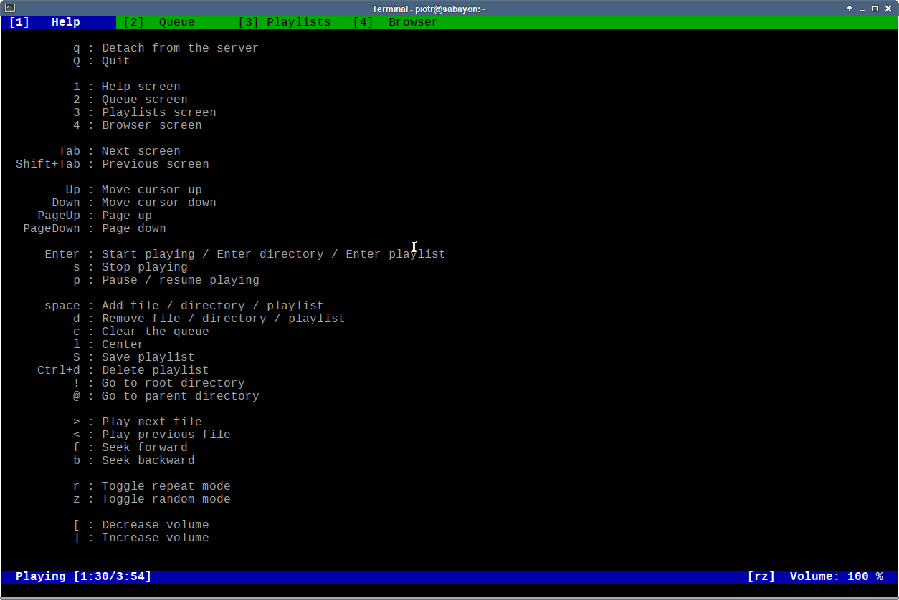

# About

Linux Music Player is a simple audio player for console.

# How to install

First, you need to install some dependencies (or check if they
are already installed):

  * ncurses
  * gstreamer1.0
  * gstreamer1.0-plugins-base
  * gstreamer1.0-plugins-ugly

Notice, that in your linux distribution, these packages can have
different names.

Download binaries and untar it somewhere. And that's all.

# Some notes

Configuration file you can find in ~/.config/mp

Program heavily uses gstreamer, so if your music doesn't
play, it means that you don't have installed some gstreamer plugin(s).

# Download

  * sources: [mp-src-1.2.0.tar.xz][] [simple-ui-src-0.2.0.tar.xz][]
  * binaries: [mp-x86_64-1.2.0.tar.xz][]

[mp-src-1.2.0.tar.xz]: https://github.com/piotrborek/mp/raw/main/files/mp-src-1.2.0.tar.xz
[simple-ui-src-0.2.0.tar.xz]: https://github.com/piotrborek/mp/raw/main/files/simple-ui-src-0.2.0.tar.xz
[mp-x86_64-1.2.0.tar.xz]: https://github.com/piotrborek/mp/raw/main/files/mp-x86_64-1.2.0.tar.xz

# Screenshots

